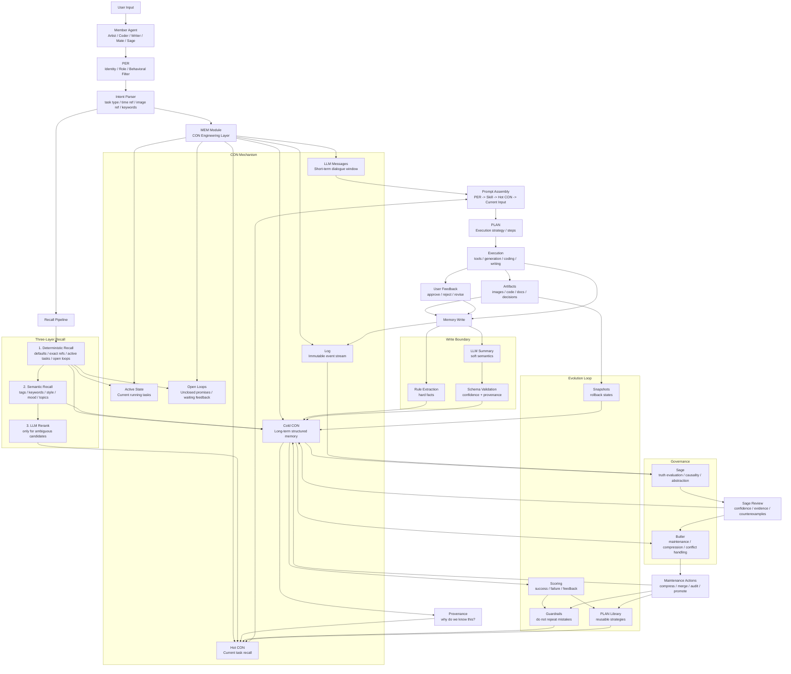
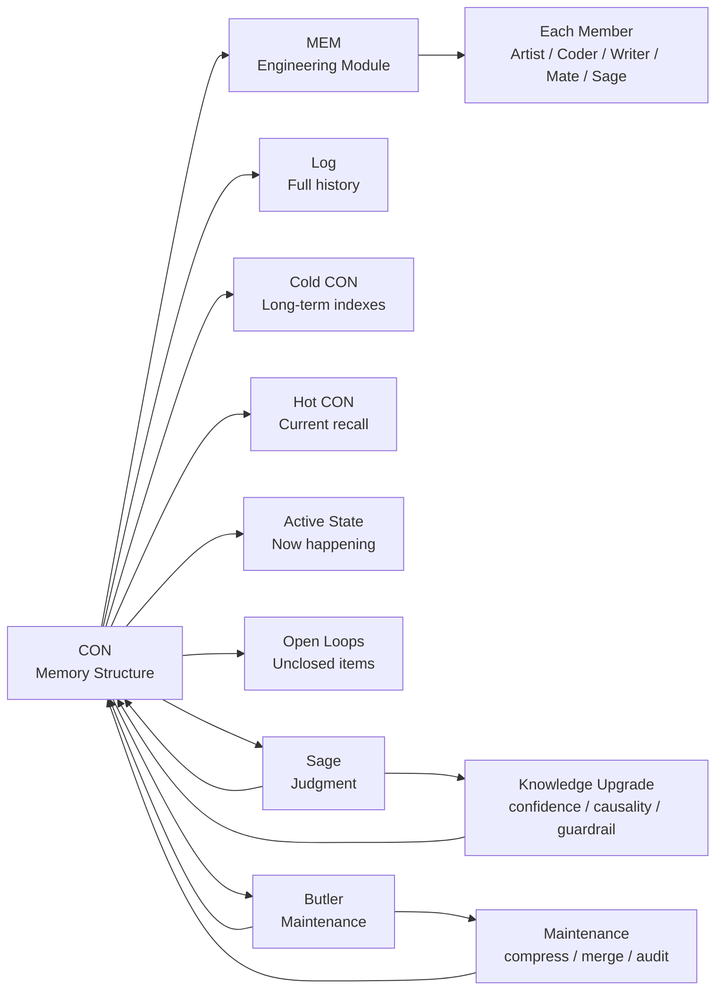
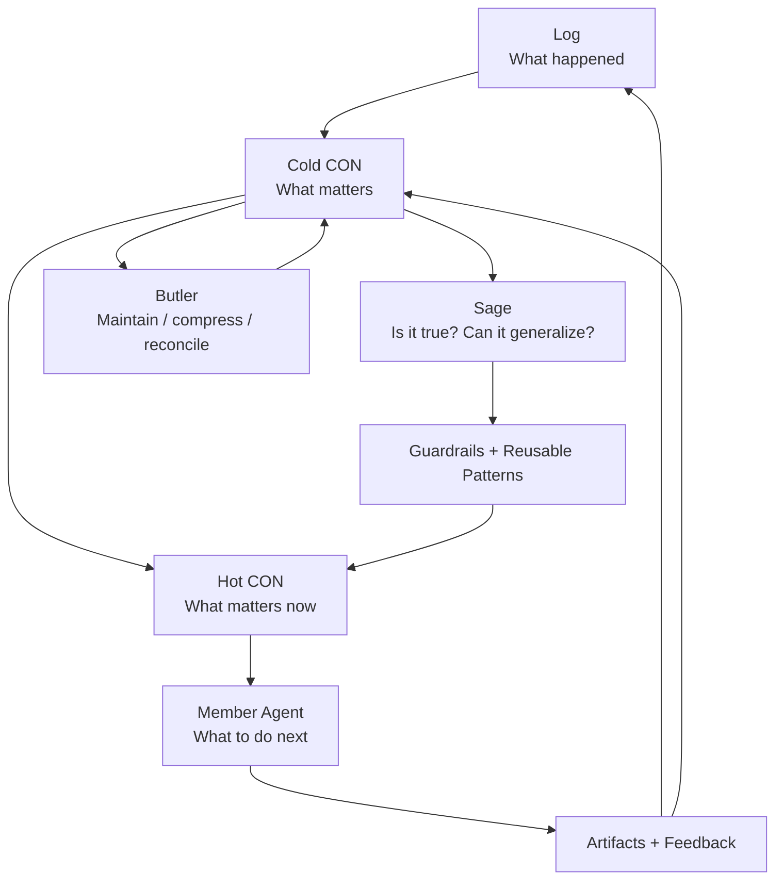

# LamTools 成员心智模型

> PER = Persona / CON = Context / PLAN = Plan / Skill = 外部指令

---

## 核心系统

| 符号 | 全称 | 职责 | 变不变 |
|------|------|------|------|
| PER | Persona | 人格底色——他是谁、怎么说话、底线是什么 | 永远不变 |
| CON | Context | 上下文管理 + 记忆保存——上下文会丢，CON 在丢之前存好；Hot CON = 本次需要的记忆（标签匹配选出），Cold CON = 索引（档案柜目录），Log = 原件 | 实时更新 |
| PLAN | Plan | 执行计划——做什么、谁来做、什么时候验收 | CON + PER → LLM 生成 |
| Skill | —— | 外部导入的人设外指令文件 | 用户提供，加载后注入 CON |

> **已精简**：去掉了独立的 Mentation 层——PER 锁住人格基调，CON 提供情境信号，LLM 结合两者自行调节思维模式，不需要预设模式集和运行时切换。

---

## 运转逻辑

```
设计时：
  persona.md ──→ 定义 PER (恒定滤网)
  skill.md   ──→ 加载至 CON (临时偏转)

运行时：
  PER (恒定) ──┐
                ├──→ 指导 LLM 输出风格
  CON (实时) ──┘
    ▲             │
    │             ▼
    │          LLM ──→ PLAN ──→ 驱动工作
    │                              │
    │                              ▼
    └──────── 状态更新 ────────── CON
                  │
                  └── 历史 PLAN 回写 CON（自进化）
```

### 关系

- **PER 是滤网，CON 是输入。** PER 锁死 LLM 的输出边界——Coder/Writer 永远不可能话多。CON 告诉 LLM 当前发生了什么。LLM 结合两者自行调节。
- **LLM 生成 PLAN。** PLAN 是从 PER + CON 推导出来的结构化执行计划。同一 CON 在不同 PER 下出不同的 PLAN。
- **PLAN 驱动工作，工作更新 CON。** 状态、产出、成员动态写回 CON。完成的 PLAN 骨架回写 CON 历史维——下次相似任务匹配复用，自进化。
- **Skill 是外部文件，不是运行时层。** 进入 CON 作为信号源，经过 PER 过滤后才生效。同一份 Skill 在 Coder/Writer 身上出极简代码，在 Imager/Artist 身上出留白构图。
- **无循环依赖。** PER 不变，PLAN 单向生成，CON 单向被工作更新。

---

## Mate 特殊处理

Mate 初始 PER 为空，LLM 在无 PER 过滤下运行。随着 CON 积累，LLM 从 CON 中反向推导出 PER。一旦 PER 生成，锁定后续行为范围。

---

## Prompt 组装线

```
PER ───────────┐
Skill ─────────┤
Hot CON(匹配) ─┼──→ System Prompt
                   │
对话历史 ──────────┤
用户输入 ──────────┼──→ Messages（固定窗口，超出裁剪）
成员动态 ──────────┘
                   │
                   ▼
                  LLM
                   │
                   ▼
            PLAN（结构化输出）
```

**各层落地位置**：

| 来源 | 进 Prompt 的什么位置 | 示例 |
|------|------|------|
| PER | System——第一段，永不冲刷 | "你是 LamCoder/Writer。24岁。能用两个字不用一句话。" |
| Skill | System——第二段，active 时注入 | "当前加载Skill：极简函数式。减少注释。纯函数优先。" |
| Hot CON（偏好） | System——第三段，标签匹配选出 | "用户偏好：冷色调、竖版、简洁反馈" |
| Hot CON（默认参数） | System——第四段 | "默认模型：xxx，默认尺寸：2k" |
| Hot CON（PLAN骨架） | System——第五段，只进匹配的 | "上次类似表情包任务：radiate、3步、通过" |
| 对话历史 | Messages——固定窗口（N 轮） | 用户："这个先停" → Coder："行" |
| 成员动态 | Messages——摘要注入 | "[Butler：Imager配色已交付，路径：xxx]" |

**组装规则**：

- **PER → Skill → Hot CON 顺序不可换。** PER 最先作为滤网，Skill 在它之后被它过滤，Hot CON 最后。Skill 放 PER 前会破"PER 不变"铁律。
- **Hot CON 不含对话历史。** 对话历史走 LLM Messages 固定窗口，超出裁剪。裁剪前重要信息提取到 Cold CON。
- **Hot CON 是标签匹配选出的有限集合。** 不是 Cold CON 的复制，是按当前任务需要挑选的片段。总量受 token 预算硬限制。
- **成员动态走摘要不走近原始。** 摘要格式"[Butler：xxx]"是正确的粒度——给结论不给人脸。
- **PLAN 不进 prompt。** PLAN 是 LLM 的输出。只有已执行完、已写入 Cold CON 的历史 PLAN 骨架才能作为输入出现。

---

## PLAN 到执行

每个成员自带最小自执行引擎。Butler 是加速器和安全保障，不是启动条件。

```
有 Butler：
  PLAN → Butler 解析 → 分配成员 → 设验收 → 依赖编排 → 监控

无 Butler (独立)：
  PLAN → 自执行引擎 → 逐 step 循环 → 完成
          ↑
     (每个成员内置)
```

**Coder/Writer 独立执行示例**：

```
PLAN steps:
  1. 分析需求
  2. 写核心模块
  3. 写测试

自执行循环：
  for step in steps:
    调用 Coder/Writer LLM → 产出 → 写入 CON
    if step 失败: 返回错误（无 Butler 不重规划）
```

**CON 写入**：PLAN 产出结构化字段，执行后 CON 更新靠规则提取——JSON 字段搬运，不走 LLM。

---

## CON 分层：上下文管理 + 记忆保存

CON 的本质：**上下文会丢，CON 是在丢之前把记忆存好的手段。**

这摒弃了传统的上下文管理方案——传统方案要么无限膨胀（全历史注入），要么暴力截断（固定窗口丢弃），要么依赖 LLM 压缩摘要（有损且不可控）。CON 的方案是：**承认丢失不可避免，但在丢失之前把值得留的信息结构化地存好，未来按需检索，不依赖完整上下文在线。**

```
五层结构：

LLM Messages（上下文）
  → 自然膨胀 → 固定窗口裁剪 → 旧内容丢弃
  → 裁剪前：完整对话总结写入 Cold CON

Hot CON（本次需要的记忆）
  → 从 Cold CON 按标签匹配选出的结构化片段
  → 注入 System Prompt，严格控体积
  → 不含对话历史——对话历史走 LLM Messages 固定窗口
  → 对话结束 → 归档回 Cold CON → 清空

Active State（自我感知）
  → 当前活跃状态：正在执行的任务、等待反馈的作业、待处理的派工
  → 不进 prompt（太动态），被问时实时查询
  → 跨所有 session 的当前状态快照
  → 与 Butler 的内感同构，但范围是自己的

Cold CON（索引 = 档案柜的目录）
  → 指向 Log 的结构化索引
  → 不是记忆本身，是记忆的目录
  → 按标签检索 → 选出 Hot CON

Log（原件 = 档案柜里的原始文件）
  → 准确记忆，一字不差
  → 只写不读（太大了，不能进 prompt）
  → Cold CON 损坏时从此重建
```

### 各层内容

| 层 | 存什么 | 进 prompt | 膨胀 |
|------|------|------|------|
| Hot CON | 标签匹配选出的偏好、默认参数、匹配的 PLAN 骨架 | 是（System Prompt） | 不膨胀——有限集合，每项有 token 预算 |
| Active State | 活跃任务、等待反馈、待处理派工 | 否（被问时实时查询） | 不膨胀——只在任务进行中存在 |
| Cold CON | 用户档案、对话摘要 + 产出索引、偏好溯源、PLAN 库、成员动态 | 否 | 膨胀——但只做索引查询，Butler 定期维护 |
| Log | 完整 session messages、billing、events | 否 | 膨胀——只写不读，不可变 |

### Cold CON 六项索引

| 索引 | 内容 | 示例 |
|------|------|------|
| 用户档案 | 偏好维度 + 权重 | "冷色调(权重0.8)、竖版(权重0.6)、4张(权重0.9)" |
| 对话摘要 | hash + 标题摘要 + 完整总结 + 时间 + 标签 | "a3f7c2e1 | 赛博朋克猫·冷蓝调构图讨论 | 聊了半小时构图，试了3种色调，选了冷蓝调" |
| 产出索引 | 图片/代码 + 用户反馈 + 标签 + 来源 hash | "img_003 | 表情包锚点 | 用户确认 | Q版风格 | ← b8d4e9f2" |
| 偏好溯源 | 偏好 → 建立来源（hash + 标题摘要） | "冷色调 ← a3f7c2e1 赛博朋克猫·冷蓝调构图讨论" |
| PLAN 库 | 历史 PLAN 骨架 + 标签 + 评分 | "radiate_表情包 | 3步 | 评分0.85" |
| 成员动态 | Butler/其他成员的状态摘要 | "[Butler：Imager配色已交付]" |

### Active State 结构

```json
{
  "active_tasks": [
    {"session": "对话A", "status": "executing", "task": "表情包6张", "progress": "4/6", "started_at": "..."},
    {"session": "对话B", "status": "waiting_feedback", "task": "产品图精修", "delivered_at": "..."}
  ],
  "pending_tasks": [
    {"source": "butler", "task": "做一套产品图", "received_at": "..."}
  ],
  "idle_since": null
}
```

- **谁写**：成员自己——每次开始/完成/等待时更新
- **谁读**：被问时实时读取，不主动推送
- **生命周期**：任务完成 → 从 active_tasks 移除 → 对话摘要写入 Cold CON

### Hot CON 标签匹配机制

Hot CON 不是"把 Cold CON 复制一份"，是按需挑选：

```
新对话开始：
  1. 时间过滤（优先级最高）
     "昨天" → 过滤出 2026-05-14 的对话摘要
     "前两天" → 过滤出最近 3 天的对话摘要
     无时间引用 → 不过滤

  2. 精确匹配（权重最高）
     task_type == "image_gen" → 选出相关偏好、PLAN、产出
     strategy == "radiate" → 选出 radiate 类型的 PLAN 骨架

  3. 语义匹配（权重中等）
     keywords ∩ topics/style/mood → 选出风格相关的偏好和产出
     "那个方案" → topics 含"方案"的对话

  4. 情感匹配（无任务维度时触发）
     "这段时间累吗" → 扫近期对话的 sentiment + intensity
     → 选出近期 high intensity 的对话摘要

  5. 默认参数（无条件注入）
     默认模型、默认尺寸、默认数量

  Hot CON = 1~5 的交集（总量受 token 预算硬限制）
```

对话进行中：对话历史走 LLM Messages 固定窗口，不进 Hot CON。产出、偏好变更写回 Cold CON。

对话结束：Hot CON 归档 → 更新 Cold CON（新增对话摘要、产出索引、偏好溯源）→ 清空 Hot CON。

### 对话摘要标签体系

每条对话摘要索引带结构化标签，由 LLM 在对话结束时生成：

```
标签枚举：
  task_type: image_gen | optimize | assistant | plan | vision | chat
  strategy: single | parallel | iterative | radiate | none
  style: 赛博朋克 | 写实 | 二次元 | 极简 | Q版 | 水彩 | ...（开放枚举，LLM 可生成新值）
  mood: 冷蓝调 | 暖色调 | 高对比 | 低饱和 | ...（开放枚举）
  sentiment: 满意 | 不满意 | 犹豫 | 兴奋 | 平静（对话整体情感）
  intensity: high | medium | low（对话深度：high=深度讨论, low=随口提）
  topics: [关键词列表]（话题关键词，不只是任务关键词）
  time: ISO 日期（对话发生时间）
```

### 匹配信号来源

意图解析节点扩展输出，作为匹配信号：

```
意图解析结果（扩展后）：
  task_type: "image_gen"        ← 任务维度
  strategy_hint: "radiate"      ← 策略维度
  keywords: ["表情包", "猫咪"]   ← 内容维度
  style_hint: "Q版"             ← 风格维度
  time_ref: "昨天"              ← 时间引用（代码级规则解析："昨天"→today-1）
  sentiment_ref: null           ← 情感引用
```

时间引用解析 v1 用代码级规则（正则匹配"昨天/前两天/上周"→日期范围），v2 可用 LLM。

### 上下文压缩流程

```
对话进行中：
  LLM Messages 增长 → 超出窗口 → 压缩摘要（旧内容裁剪）
  
  裁剪前：完整对话总结写入 Cold CON
    不是只提取"重要信息"——记得本身就是价值
    结论级：偏好变更、产出、PLAN → 高价值，直接指导下次行为
    过程级：聊了什么方向、试了什么方案 → 中价值，提供上下文关联
    存在级：随口提了什么、还没开始的事 → 低但不可忽略，用户再提时能接上
  
  对话结束后归档：
    hash = SHA256(对话内容)[:8] — 唯一标识，不依赖 session_id
    标题摘要 = 自动生成的短标题 — 人可读，Artist 检索时一眼知道是哪次对话
    标签 = LLM 生成（task_type, strategy, style, mood, sentiment, intensity, topics）
    对话摘要 = hash + 标题摘要 + 完整总结 + 标签
    偏好溯源 = 偏好变更 + 来源指向（hash + 标题摘要）
    产出索引 = 产出 + 用户反馈 + 标签
    PLAN 索引 = 使用的策略 + 步骤 + 评分
```

**记忆的三层价值**：

| 层 | 价值 | 例子 | Artist 怎么用 |
|------|------|------|------|
| 结论 | 高——直接指导下次行为 | "用户偏好冷色调" | 下次出图自动用冷色调 |
| 过程 | 中——提供上下文关联 | "聊了半小时构图方向，试了3种色调" | 用户说"上次那个构图"→Artist 知道是哪个 |
| 存在 | 低但不可忽略——记得发生过 | "用户随口提了表情包项目，还没开始" | 用户说"上次那个表情包"→Artist 能接上，不茫然 |

存在级记忆不主动推送——Artist 不会说"上次你提过表情包"（默而不瞒）。但用户再提时，Artist 从 Cold CON 检索到相关摘要，自然接上。

### Cold CON 维护

| 维护动作 | 触发条件 | 效果 | 谁做 |
|---------|---------|------|------|
| 对话摘要压缩 | 对话摘要超过 30 条 | 旧的合并为周期摘要 | Butler / 成员自维护 |
| 偏好权重衰减 | 长期未再印证的偏好 | 权重自动缓慢回落 | Butler |
| 产出索引清理 | 产出索引超过 100 条 | 低评分产出降级为摘要 | Butler |
| PLAN 库评分 | 每次使用 PLAN 骨架时 | 命中率 + 成功率 + 信息熵 + 时滞 → 保留或淘汰 | 成员自维护 |

v1（无 Butler）：对话结束时成员自维护（写入摘要、更新偏好、评分 PLAN）。Butler 上线后接管定期压缩和跨成员交叉印证。

### 退化态

新用户无 Cold CON → Hot CON 为空 → 等价传统 agent，纯靠 LLM Messages 窗口。不出错，只是没有记忆。

### 压缩粒度

| 时间 | 对话摘要保留粒度 |
|------|---------|
| 最近 10 次对话 | 完整总结（结论 + 过程 + 存在） |
| 10-30 次 | 压缩总结（只保留关键偏好变更 + 过程亮点 + 存在级关键词） |
| 30 次以上 | 周期总结（"5月上旬：做了3次图，偏好从暖色调转为冷色调；随口提了表情包项目"） |

偏好溯源永远保留——偏好是累积的，不是替换的。
存在级关键词永远保留——"表情包项目"这个词不会因为时间久而被删，只是权重降低，不主动推送但检索时能命中。

---

## 标签评分与维护（待 Sage 上线）

> 加分项，非必要项。单成员阶段向量检索够用。

标签体系不靠时间触发维护，靠价值评分累计到阈值触发：

| 维度 | 变化规则 |
|------|---------|
| 命中率 | 被匹配到的频率，高命中 = 加分 |
| 成功率 | 用该标签/骨架的 PLAN 通过率，高通过 = 加分 |
| 信息熵 | 匹配结果分布，过于分散 = 标签太泛 = 减分 |
| 时滞 | 最后匹配时间，越久 = 减分 |

维护分工：评分是每个成员的本地能力。Sage 上线后加跨域关联。Sage 缺席时本地标签体系照常运转。

---

## 存储结构

| 层 | 文件数 | 说明 |
|------|------|------|
| Hot CON | 每会话一个 | 会话间互不污染 |
| Active State | 每成员一个 | 跨会话状态快照 |
| Open Loops | 每成员一个 | 未闭合事项，闭合后移入 Cold CON |
| Cold CON | 全局一个 | 跨会话检索，跟人不跟会话 |
| 日志层 | 全局追加 | 常规只写不读；维护/审计/重建/用户显式要求时可读 |

---

## CON / MEM / Butler / Sage 分工

### 档案馆比喻

CON：存什么、分几层、怎么编号、怎么归档、怎么溯源。它是档案柜，也是档案分类制度。

MEM：收到一个当前任务后，决定该查哪些柜子、取哪几份档案、怎么裁剪、怎么塞进当前上下文。它是每个成员自己的取档/归档模块。

Butler：负责档案馆秩序。压缩旧档案、合并重复档案、处理跨成员冲突、安排维护、发现哪边堆太多了。

Sage：负责档案可信度。判断某条经验是不是因果、有没有反例、能不能升级成规则、置信度多少。

一句话版：**CON 是档案系统，MEM 是取档和归档机制，Butler 管档案馆秩序，Sage 判档案内容真伪与可复用性。**

### 边界

CON 不决定"这条记忆该不该相信"。
MEM 不决定"这条经验能不能泛化"。
Butler 不判断"这条结论是不是真的"。
Sage 不直接替成员取档案。

各司其职：

```
CON owns memory.
MEM owns retrieval/write mechanics.
Butler owns maintenance.
Sage owns judgment.
```

### Sage 与 CON 的交互

Sage 不自己保存一套独立记忆，否则会和 CON 分裂。正确方式：

- Sage 的结论写回 CON
- Sage 的证据必须指向 CON/Log 的 memory_id
- Sage 不拥有事实，只拥有评估

Sage 不改历史，只追加评估层：

```json
{
  "memory_id": "err_20260516_001",
  "sage_review": {
    "claim": "修改意图必须自动携带目标图",
    "evidence": ["event_a", "event_b", "event_c"],
    "confidence": 0.9,
    "scope": ["artist", "imager"],
    "counterexamples": ["用户明确要求重新生成"],
    "recommendation": "promote_to_guardrail"
  }
}
```

Sage 给出建议，Butler 决定何时执行：

```
promote_to_guardrail    → 写入 guardrail
merge_duplicate_memories → 合并重复记忆
downgrade_confidence    → 降低置信度
needs_more_evidence     → 标记待验证
conflict_detected       → 标记冲突
```

### 三种记忆层级

```
1. Event Memory
   发生了什么。
   由 CON/Log 记录。

2. Experience Memory
   这次为什么成功/失败。
   由 CON + 成员自评 + 用户反馈形成。

3. Knowledge Memory
   这个规律是否可靠、能否复用、是否应变成 guardrail。
   由 Sage 评估。
```

### 进化闭环

```
经验 → 评估 → 升级 → 预防/复用 → 新表现
```

完整链路：

```
1. 成员执行任务
2. CON 记录事件、产出、反馈
3. MEM 把可用内容索引化
4. Sage 评估哪些经验可靠
5. Butler 安排维护/升级/冲突处理
6. 成功经验进入 PLAN Library
7. 失败经验进入 Guardrail
8. 下次任务前 MEM 召回相关规则
9. 成员行为改变
```

没有 Sage 也能记忆，但进化会比较粗糙——记得多，但不一定判断得准。有 Sage 不只记得，还会反思、验证、抽象。

---

## CON 架构 Mermaid

### 完整流程



### 简化关系



### 一句话版


